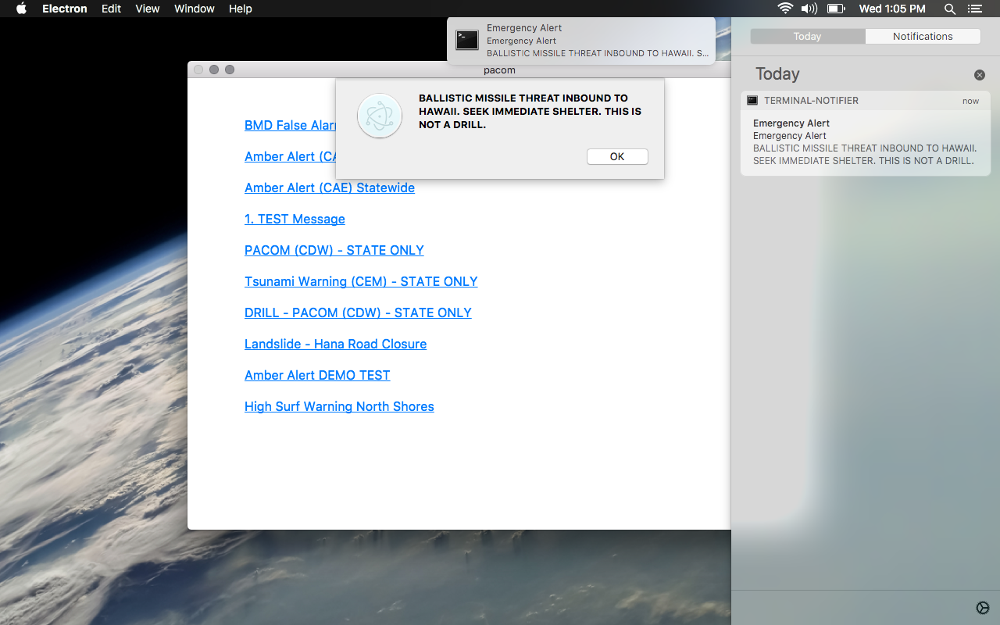

# pacom
Powerful minimalist graphic user interface framework for cross platform UI and ICBMS.



# restrictions

Dynamic data is not allowed, everything must be pre-coded in the state object.

# answers

The center of control is the disk.
In order to alter the screen or state, data must be written to disk.
File system monitoring will detect the change and alter the state object.
State object will be monitored by a data proxy that will dispatch change events.

# questions

1. Where is the center of control? Should it be disk or emitter...
  - What controls UI data?
  - Where will data change? (On disk?)

2. What should html look like? Should it be HBS or Vue?
  - HTML minimalism is key as it assures maximum portability.

# usage

Install node: https://nodejs.org/en/

Install epx: ```npm i -g epx```

Launch: ```epx pacom```
